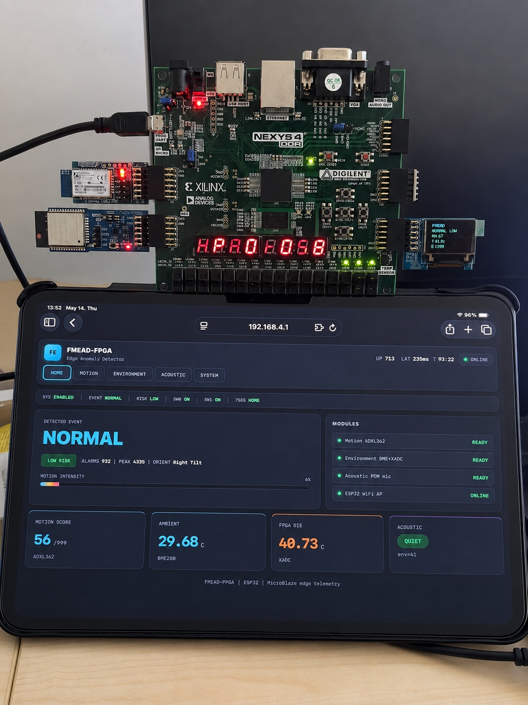
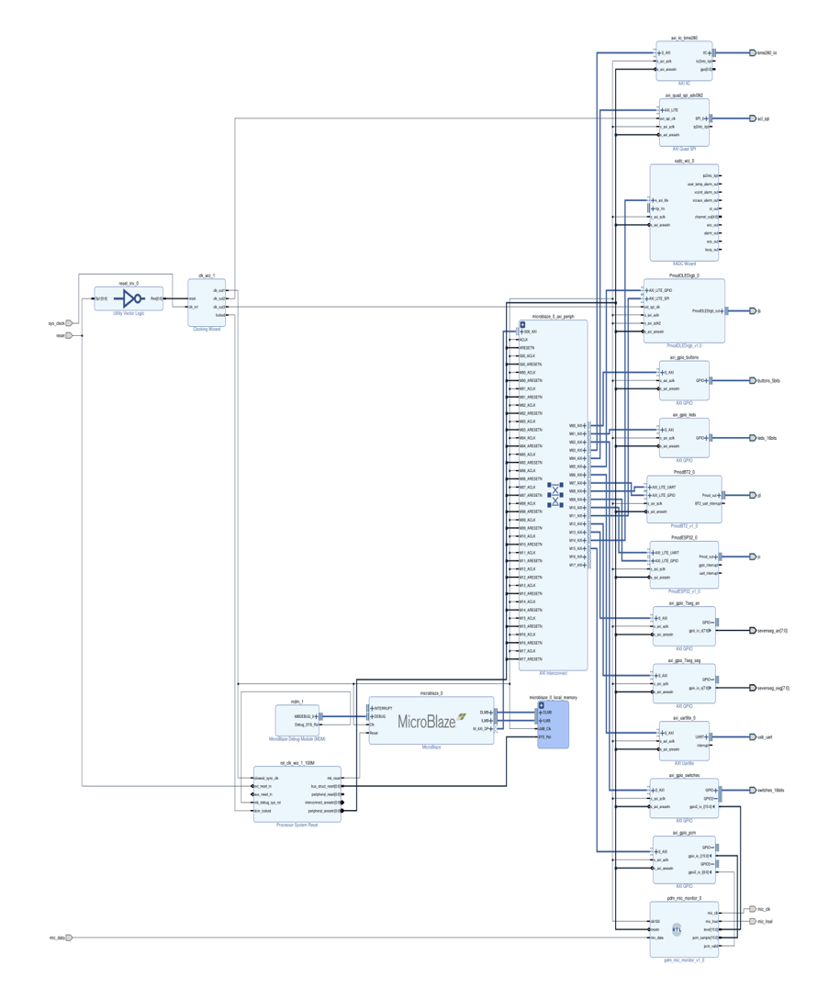
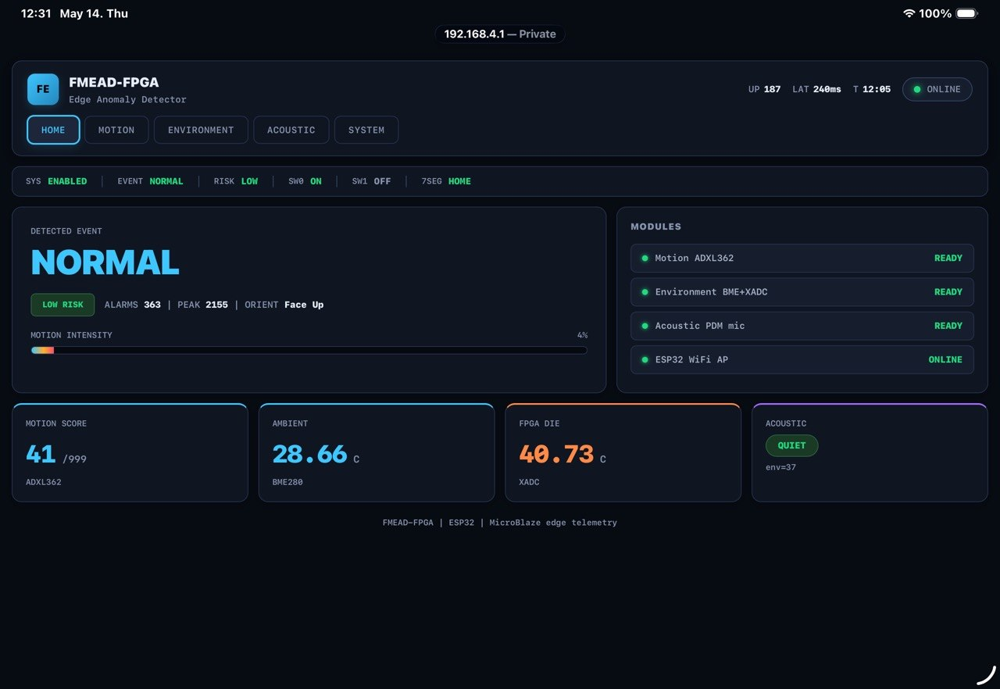
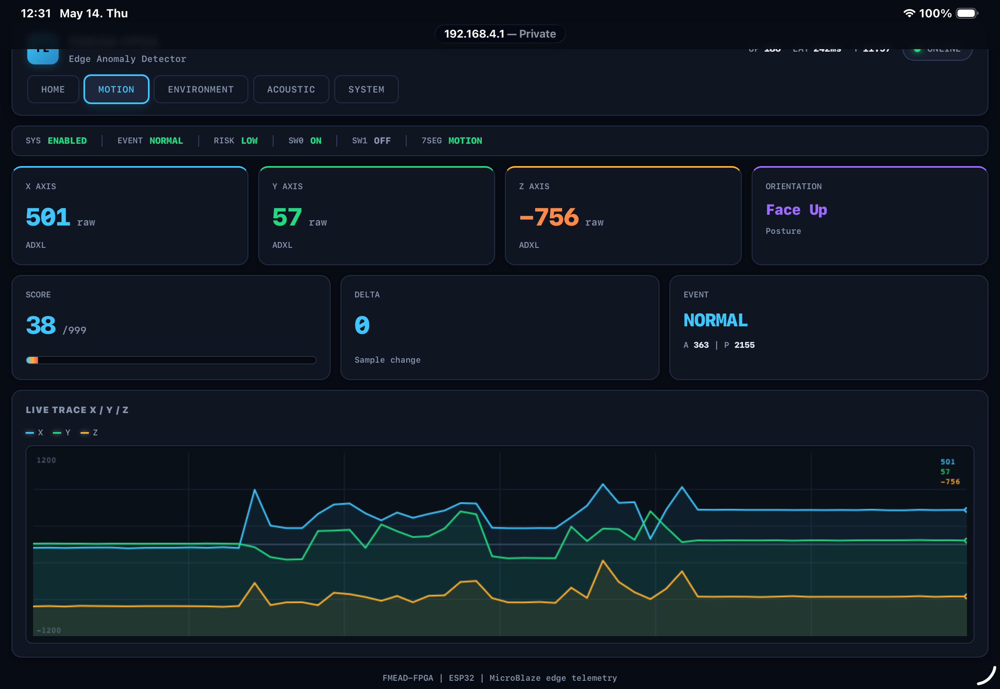
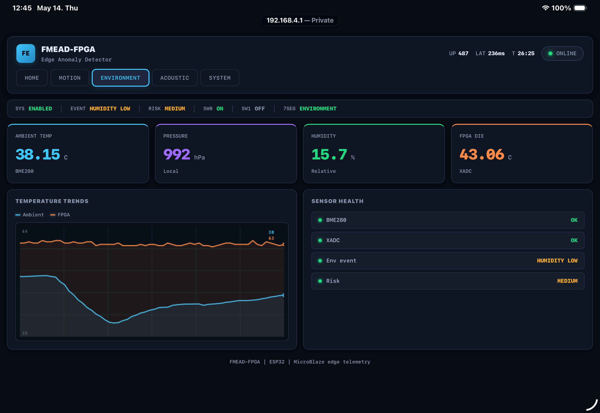
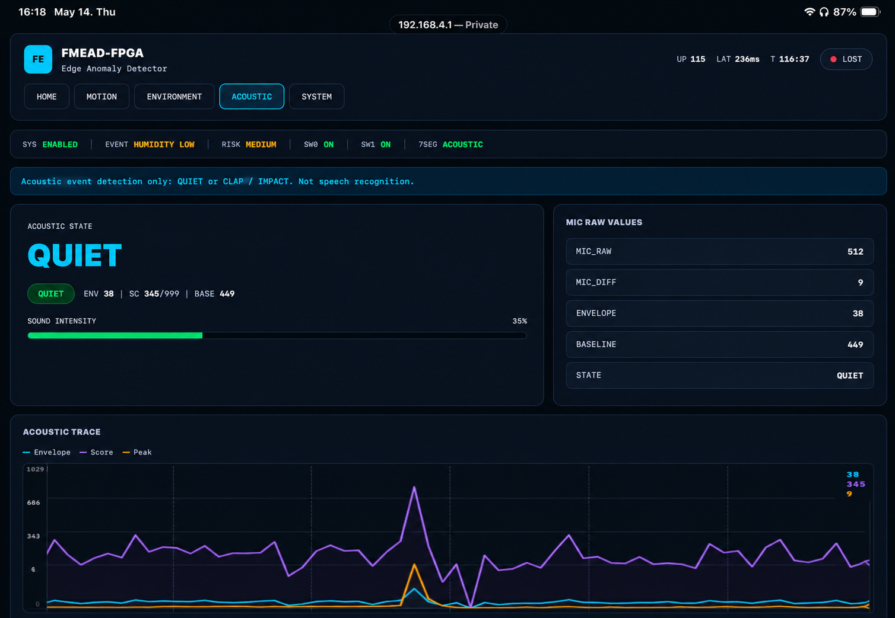
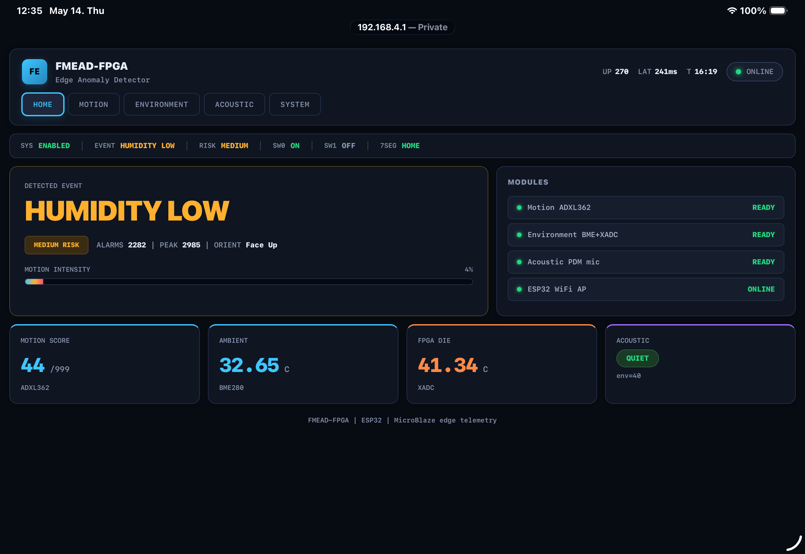
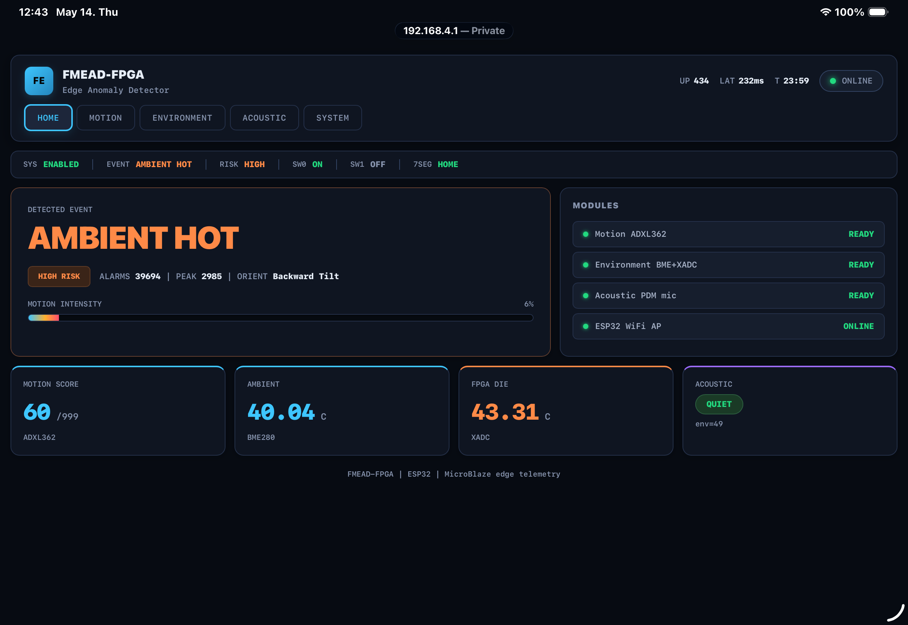
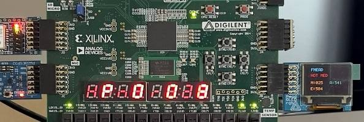

# FMEAD-FPGA

**FPGA Multi-Modal Edge Anomaly Detector**

FMEAD-FPGA is a multi-modal edge anomaly detection system implemented on a Digilent Nexys 4 DDR FPGA board using a MicroBlaze soft processor.

The system combines motion sensing, environmental monitoring, acoustic event detection, FPGA temperature telemetry, local hardware feedback, and a WiFi dashboard to detect and visualize edge-level anomalies in real time.

This project was developed as a practical reconfigurable embedded system, integrating hardware design in Vivado with bare-metal firmware development in Vitis.

---

## Project Summary

FMEAD-FPGA demonstrates how an FPGA-based embedded system can acquire data from multiple physical sensors, process that data locally, classify simple anomaly events, and present the results through both local hardware outputs and a browser dashboard.

Instead of sending raw sensor data to a remote computer or cloud service, the system performs the main acquisition, filtering, event classification, and visualization directly on the FPGA platform through a MicroBlaze-based embedded design.

The project focuses on practical engineering integration:

- FPGA hardware design
- MicroBlaze soft processor system
- AXI-based peripheral integration
- Bare-metal C firmware
- Real sensor acquisition
- Local anomaly classification
- WiFi dashboard visualization
- Local display feedback

The system is designed as an academic and portfolio prototype. It is not a certified safety device.

---

## Main Capabilities

The current system can monitor and display:

- Normal motion
- Board movement
- Vibration
- Impact-like events
- Fall candidate behavior
- Ambient temperature
- Humidity
- Atmospheric pressure
- FPGA die temperature
- Acoustic clap or impact events
- Sensor readiness
- Global system status
- Risk level

The system provides feedback through:

- LEDs
- Seven-segment display
- Optional OLED output
- ESP32 WiFi dashboard
- JSON telemetry endpoint

---

## Hardware Platform

The project uses the following hardware components:

| Component | Purpose |
|---|---|
| Nexys 4 DDR | Main FPGA development board |
| Xilinx Artix-7 FPGA | Reconfigurable hardware platform |
| MicroBlaze | Soft-core processor running the firmware |
| ADXL362 | Three-axis accelerometer for motion detection |
| BME280 | Environmental sensor for temperature, humidity, and pressure |
| XADC | Internal FPGA die temperature monitoring |
| PDM microphone | Acoustic event detection |
| PmodESP32 | WiFi access point and dashboard communication |
| Seven-segment display | Local status and event display |
| LEDs and switches | Local control and status indication |
| Pmod OLED RGB | Optional local visual output |
| PmodBT2 | Prepared Bluetooth telemetry extension |

---

## System Architecture

The system is built around a MicroBlaze soft processor instantiated inside the FPGA fabric.

The MicroBlaze communicates with multiple peripherals through AXI-based interfaces. Sensor values are collected, processed in firmware, classified into event states, and then displayed locally and remotely.

```text
Physical Sensors
  |
  |-- ADXL362 accelerometer
  |-- BME280 environmental sensor
  |-- XADC FPGA temperature monitor
  |-- PDM microphone
  |
  v
MicroBlaze Soft Processor
  |
  |-- Sensor acquisition
  |-- Filtering
  |-- Event classification
  |-- Risk level selection
  |-- Dashboard data generation
  |
  v
Outputs
  |
  |-- LEDs
  |-- Seven-segment display
  |-- Optional OLED display
  |-- ESP32 WiFi dashboard
  |-- Prepared Bluetooth telemetry
```

---

## Vivado Hardware Design

The FPGA hardware design was created in Vivado using IP Integrator.

The design includes:

- MicroBlaze processor
- Local memory
- AXI interconnect
- AXI Quad SPI for ADXL362
- AXI IIC for BME280
- XADC Wizard for FPGA die temperature
- AXI GPIO blocks for LEDs, switches, buttons, microphone data, and seven-segment display
- UART interface for ESP32 AT communication
- Pmod OLED RGB interface
- Prepared PmodBT2 interface
- Custom PDM microphone monitor path

The Vivado design was implemented as a complete embedded system inside the FPGA, not as a single isolated peripheral.

---

## Firmware Architecture

The firmware is a bare-metal C application developed in Vitis.

There is no operating system. The application runs as a deterministic main loop that initializes the hardware, reads sensors, updates classifiers, refreshes local outputs, and handles ESP32 HTTP communication.

The main firmware file is located at:

```text
firmware/mb_edge/src/main.c
```

The firmware includes:

- Sensor initialization
- ADXL362 motion reading
- BME280 compensation and measurement logic
- XADC temperature reading
- PDM microphone event detection
- Motion classification
- Environmental classification
- Acoustic classification
- Global event fusion
- Seven-segment display control
- LED status output
- ESP32 AT command handling
- HTTP dashboard serving
- JSON telemetry generation

---

## Motion Detection

Motion detection is based on data from the ADXL362 accelerometer.

The firmware reads X, Y, and Z acceleration values and processes them using a lightweight filtering and state-based detection approach.

The motion pipeline includes:

- Raw accelerometer sampling
- Fast filtering for movement response
- Slow baseline reference tracking
- Motion score calculation
- Jerk-like change estimation
- Vibration accumulation
- Hysteresis to reduce false transitions
- Hold and cooldown logic for stable event display

Supported motion states include:

```text
NORMAL
MOVING
VIBRATION
IMPACT
FALL CANDIDATE
```

The goal is to separate normal handling from stronger physical events such as shaking, impact, or possible fall-like behavior.

---

## Environmental Monitoring

The BME280 sensor is used to monitor environmental conditions.

Measured values include:

- Ambient temperature
- Relative humidity
- Atmospheric pressure

The firmware applies the BME280 compensation logic to convert raw sensor values into usable physical measurements.

The environmental logic can classify conditions such as:

```text
NORMAL
AMBIENT WARM
AMBIENT HOT
HUMIDITY LOW
HUMIDITY HIGH
```

These values are shown on the WiFi dashboard and included in the JSON telemetry endpoint.

---

## FPGA Temperature Monitoring

The XADC block is used to monitor the internal FPGA die temperature.

This is useful because FPGA die temperature is different from ambient temperature. It depends on board activity, airflow, and internal FPGA workload.

The XADC value is displayed in the dashboard and used as part of the system health information.

---

## Acoustic Event Detection

The acoustic subsystem uses a PDM microphone path exposed to the MicroBlaze firmware.

The current implementation focuses on simple acoustic event detection. It does not perform speech recognition, word detection, speaker identification, or music recognition.

The visible acoustic states are intentionally simple:

```text
QUIET
CLAP / IMPACT
```

The system is designed to detect short, strong acoustic events such as:

- Claps
- Knocks
- Impact-like sounds

The firmware uses a lightweight baseline and threshold-based approach with hold and refractory logic to reduce repeated false triggers.

---

## Event Fusion and Risk Levels

Each sensing module produces a local event and a risk level.

The firmware combines these module-level events into one global system state. The most important active event is promoted to the dashboard and local display outputs.

Example global events include:

```text
NORMAL
MOVING
VIBRATION
IMPACT
FALL CANDIDATE
AMBIENT HOT
HUMIDITY LOW
CLAP / IMPACT
SENSOR OFFLINE
```

Risk levels are used to simplify the system status:

```text
LOW
MEDIUM
HIGH
```

This makes the system easier to understand during live demonstrations.

---

## WiFi Dashboard

The project uses a PmodESP32 module running AT firmware to provide a WiFi dashboard.

The ESP32 is configured as a WiFi access point. After connecting to the board network, the user can open the dashboard in a browser and monitor the system in real time.

Main routes:

```text
/       Main dashboard
/data   JSON telemetry endpoint
```

The dashboard displays:

- Global event
- Risk level
- Motion status
- Environmental data
- FPGA temperature
- Acoustic state
- Sensor readiness
- System telemetry
- Live updates from the JSON endpoint

The dashboard makes the project easier to demonstrate without depending only on a serial monitor.

---

## Local Output Interfaces

### Seven-Segment Display

The Nexys 4 DDR seven-segment display is used for local feedback.

It provides quick status information directly on the board, which is useful when the browser dashboard is not open.

The display is driven through AXI GPIO and refreshed in firmware.

### LEDs and Switches

LEDs and switches are used for local control and status indication.

They help during debugging and demonstration because they provide immediate hardware-level feedback.

### OLED Display

The OLED display support is included as an optional local visualization interface.

Its purpose is to show compact system information such as project label, event state, score, or risk level.

The main validated output remains the WiFi dashboard and the seven-segment display.

### Bluetooth Support

A PmodBT2 Bluetooth interface was prepared in the hardware structure as a future extension.

The intended purpose is to support lightweight local telemetry or alert messages through Bluetooth serial communication.

This feature was prepared but not fully validated as part of the final demonstration.

---

## Demo Video

A short hardware demonstration video is available here:

[Watch demo video](media/videos/demo-video.mov)

---

## Demo Images

### Final Integrated Prototype



### Vivado Block Design



### Home Dashboard



### Motion Dashboard



### Environmental Dashboard



### Acoustic Dashboard



### Humidity Low Event



### Clap Impact Event


### Ambient Hot Event



### OLED and Seven-Segment Display



---

## Project Structure

```text
FMEAD-FPGA/
│
├── firmware/
│   └── mb_edge/
│       └── src/
│           ├── main.c
│           ├── lscript.ld
│           └── README.txt
│
├── vitis_platform/
│   └── mb_edge_wrapper/
│
├── vivado_project/
│   ├── lab_10.xpr
│   ├── lab_10.srcs/
│   ├── mb_edge_temp_motion_anomaly_lab13_14.xpr
│   └── mb_edge_temp_motion_anomaly_lab13_14.srcs/
│
├── hardware_export/
│   ├── lab10_pomd_wrapper.xsa
│   └── mb_edge_wrapper.xsa
│
├── docs/
│   └── FMEAD-FPGA_Technical_Documentation.pdf
│
├── media/
│   ├── screenshots/
│   └── videos/
│       └── demo-video.mov
│
├── .gitignore
└── README.md
```

---

## Main Files and Folders

### Firmware

```text
firmware/mb_edge/src/main.c
```

Contains the main bare-metal MicroBlaze application.

### Vivado Project

```text
vivado_project/
```

Contains the FPGA hardware design, block design, IP configuration, and source files.

### Vitis Platform

```text
vitis_platform/
```

Contains the exported hardware platform used by Vitis.

### Hardware Export

```text
hardware_export/
```

Contains XSA files exported from Vivado.

### Documentation

```text
docs/FMEAD-FPGA_Technical_Documentation.pdf
```

Contains the full technical documentation of the project.

### Screenshots

```text
media/screenshots/
```

Contains prototype photos, dashboard screenshots, and demonstration images.

### Videos

```text
media/videos/
```

Contains the short hardware demonstration video.

---

## Current Status

Implemented and tested:

- MicroBlaze embedded system
- ADXL362 accelerometer integration
- BME280 environmental sensor integration
- XADC FPGA temperature monitoring
- PDM microphone acoustic event detection
- ESP32 WiFi access point
- HTTP dashboard
- JSON telemetry endpoint
- Seven-segment display feedback
- LED status feedback
- Main firmware logic
- Technical documentation
- GitHub project organization

Prepared or optional:

- OLED local visualization
- Bluetooth alert or telemetry support

---

## Limitations

The current prototype has the following limitations:

- Acoustic detection is limited to clap or impact-like events
- Speech recognition is not implemented
- Speaker identification is not implemented
- Music recognition is not implemented
- Motion detection is threshold and state-machine based
- Thresholds may need tuning for different environments
- Bluetooth telemetry was prepared but not fully validated
- OLED output is optional and not required for the main system
- The dashboard is optimized for demonstration, not production deployment
- The system does not currently store long-term event logs
- The project is an academic FPGA prototype, not a certified safety device

---

## Future Work

Possible future improvements include:

- Improve motion sensitivity calibration
- Add dashboard-based threshold configuration
- Add stronger fall detection logic
- Add adaptive thresholds for different environments
- Improve vibration and impact separation
- Add persistent event logging
- Add long-term telemetry history
- Improve dashboard responsiveness and memory usage
- Add smaller dashboard pages to reduce MicroBlaze memory pressure
- Complete and test Bluetooth alert messages
- Improve OLED visualization
- Add real PDM-to-PCM audio conversion
- Add FIFO or AXI Stream support for microphone samples
- Move selected signal processing tasks into custom FPGA logic
- Add lightweight edge machine learning using fixed-point models
- Add SD card or external memory logging
- Improve firmware modularity

---

## Tools Used

- Vivado
- Vitis
- MicroBlaze
- Bare-metal C
- AXI GPIO
- AXI Quad SPI
- AXI IIC
- XADC Wizard
- ESP32 AT firmware
- Git
- GitHub
- PowerShell

---

## How to Open the Project

### Vivado

Open the Vivado project from:

```text
vivado_project/
```

Use the final `.xpr` file that matches the latest hardware design.

### Vitis

Open Vitis and use the workspace that contains:

```text
firmware/mb_edge
vitis_platform/mb_edge_wrapper
```

If Vitis reports that the platform is invalid, recreate or update the platform using the `.xsa` file from:

```text
hardware_export/
```

---

## Rebuild Notes

To rebuild the project:

1. Open the Vivado project.
2. Verify the block design.
3. Generate the bitstream if needed.
4. Export the hardware including the bitstream.
5. Open Vitis.
6. Update or recreate the platform using the exported XSA file.
7. Clean and rebuild the MicroBlaze firmware.
8. Program the FPGA.
9. Run the application on the board.
10. Connect to the ESP32 access point.
11. Open the dashboard in a browser.
12. Test motion, environment, acoustic events, and local outputs.

---

## Suggested Validation Checklist

Before a final demonstration, verify:

- The FPGA bitstream programs correctly
- The MicroBlaze firmware boots without freezing
- ADXL362 returns valid motion data
- BME280 returns realistic environmental values
- XADC returns plausible FPGA temperature
- PDM microphone detects clap or impact events
- ESP32 access point starts correctly
- Dashboard loads successfully
- `/data` returns live JSON telemetry
- Seven-segment display keeps refreshing during dashboard access
- LEDs respond to system state
- Optional OLED output does not block the main system
- No linker memory overflow is present

---

## Educational Value

This project demonstrates practical skills in:

- FPGA-based embedded system design
- Soft processor integration
- AXI peripheral communication
- Sensor interfacing
- Bare-metal firmware development
- Real-time state machine design
- Local hardware feedback
- WiFi dashboard integration
- Debugging hardware and software together
- Managing memory constraints in small embedded systems

---

## Author

**Amilton Domingos Alexandre Koxi**

---

## License

This project is shared for academic, educational, and portfolio purposes.

If reused, modified, or extended, please give proper credit to the original author.